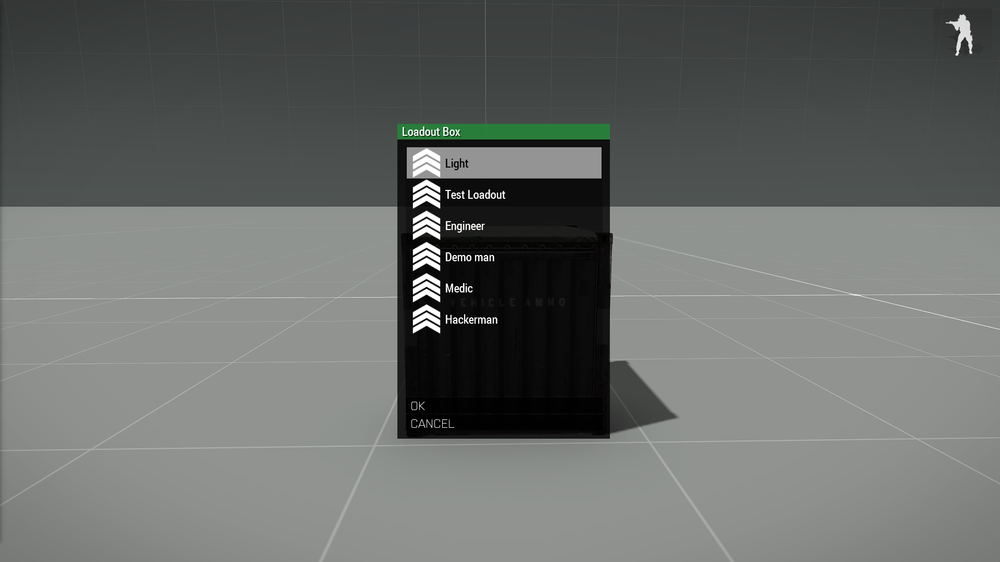

# Loadout Box
<p align="center">
  
</p>

*Figure 1: The Loadout Box UI ingame.*

## Purpose
This script adds a simple way for mission makers to give players fast access to loadouts defined in the mission's config.

## Setup
The provided [LoadouBox.vr](LoadoutBox.vr) folder is a ready to go mission.
1. Drop the LoadoutBox folder into your mission folder where the mission.sqm is.
2. Create a description.ext in the same location.
3. Add these lines to it:
```cpp
#include "LoadoutBox\CfgLoadoutBox.hpp"
class CfgFunctions
{
	#include "LoadoutBox\CfgFunctions.hpp"
};
```
4. Place any object in the world and add this line to the init:
```sqf
[this] call TER_fnc_addLoadoutBox;
```
5. The system is now functional.

## Customization
The config follows the same structure as description.ext's [CfgRespawnInventory](https://community.bistudio.com/wiki/Description.ext#CfgRespawnInventory).
1. Export a loadout from the Arsenal with `CTRL + SHIFT + C`
2. Open the [CfgLoadoutBox.hpp](LoadoutBox.vr/LoadoutBox/CfgLoadoutBox.hpp)
3. Create a new class, eg `class Test1`.
4. Paste the loadout under the new class.
5. Add a `displayName` and an optional `icon`.
6. You can also give the player a special trait with `traitname = 1;` (see [Unit Traits](https://community.bistudio.com/wiki/setUnitTrait)), where `traitname` is one of:
  - engineer
  - explosiveSpecialist
  - medic
  - UAVHacker

Example `CfgLoadoutBox`:
```cpp
class CfgLoadoutBox
{
	class Loadouts
	{
		class Test1
		{
			// CfgRespawnInventory specific:
			displayName = "Multi Talent";
			icon = "\A3\Ui_f\data\GUI\Cfg\Ranks\sergeant_gs.paa";
			role = "Assault";
			// Arsenal export with CTRL+SHIFT+C:
			// Exported from Arsenal by Terra
			uniformClass = "U_O_SpecopsUniform_ocamo";
			backpack = "";
			weapons[] = {"SMG_03_black","Throw","Put"};
			magazines[] = {"50Rnd_570x28_SMG_03","50Rnd_570x28_SMG_03","50Rnd_570x28_SMG_03","50Rnd_570x28_SMG_03"};
			items[] = {"FirstAidKit"};
			linkedItems[] = {"V_Rangemaster_belt","H_Cap_headphones","G_Shades_Red","ItemMap","ItemCompass","ItemWatch","ItemRadio"};
			// Traits (optional):
			engineer = 1;
			explosiveSpecialist = 1;
			medic = 1;
			UAVHacker = 1;
		};
	};
};
```
